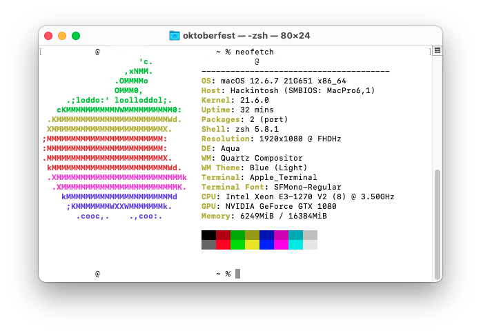

# Gigabyte H61M-S2PV w/ GTX1080 (OpenCore)
Install macOS Monterey on Gigabyte H61M-S2PV w/ GTX1080 and Ivy Brige with Dual-Boot Win 11

### Information

**DO NOT** use this EFI. Please build your own as every machine is different in it's own way. **Only use this as a reference.**

  

  

---

**Table of Contents**

- [Gigabyte H61M-S2PV w/ GTX1080 (OpenCore)](#Gigabyte-H61M-S2PV-GTX1080-OpenCore)
  - [Information](#information)
    - [Hardware](#hardware)
    - [Performance](#performance)
  - [Install macOS](#install-macos)
    - [1. BIOS Settings](#1-bios-settings)
    - [2. Sleep](#2-sleep)
    - [3. Tools](#3-tools)
    - [4. Audio](#4-audio)
    - [5. Ethernet](#5-ethernet)
  - [Update macOS](#update-macos)
  - [DualBoot Windows](#dualboot-windows)
  - [Tools](#tools)
  - [Credits and Documentation](#credits-and-documentation)

---

#### Hardware

| Component    | Variant                                  
| ------------ | ---------------------------------------- |
| Mainboard    | Gigabyte H61-S2PV                        |
| Processor    | Intel Xeon E3-1270 v2                    |
| Graphics     | MSI GTX1080                              |
| DDR3 RAM     | idk, 16GB 1600 MHz                       |
| SATA SSD     | Samsung 850 Evo 120GB                    |
| Ethernet     | Realtek 8111                             |
| Audio        | Realtek ALC887                           |

#### Performance

- For what? (haven't time for this)

---

### Install macOS

- Follow this guide [OpenCore-Install-Guide](https://dortania.github.io/OpenCore-Install-Guide/installer-guide/)

---

#### 1. BIOS Settings

    - CPU Configuration
      - Intel (VMX) Virtualization Technology: Enabled
    - USB Configuration
      - Legacy USB Support: Enabled
      - XHCI Hand-off: Enabled
    - Onboard Devices Configuration
        - Serial Port: Disabled
    - Boot
      - CSM (Compatibility Support Module)
        - Launch CSM: Disabled
    - Secure Boot
      - OS Type: Other OS

---

#### 2. Sleep

- Not tested. May NOT work.

#### 3. Tools

- Install the following from Tools:
  - `ProperTree` to modify/update `config.plist`
  - `GenSMBIOS` to generate SMBIOS
  - `OpenCore Configurator` (OCC) to modify/update `config.plist`
  - `USBMap` to mapping USB
  - `OCLP` to patch NVIDIA GPU

#### 4. Audio

- Works fine.

#### 5. Ethernet

- It works fine, there is nothing to add.

---

### Update macOS

Check the official update-guide: [OpenCore-Post-Install/update](https://dortania.github.io/OpenCore-Post-Install/universal/update.html)

1. Backup
   - Full system backup with `Time Machine` or similar software
   - Copy current EFI to OpenCore USB-Drive for recovery purpose
2. Download
   - Latest version of OpenCore and replace files in EFI
   - Updates for all installed kexts and replace in EFI
3. Reboot
   - Boot with updated OpenCore version and kexts
   - If the system doesn't boot, use OpenCore USB-Drive to roll back
4. Update
   - Start macOS Update from `System Settings` -> `Software Update`
   - With OpenCore the update process should work automatically
   - If `Software Update` shows `Mac version is up to date`, download macOS Installer from AppStore and start the update manually

If the system doesn't boot, try to fix the problem or revert to the latest EFI or system-backup.

---

### DualBoot Windows

- Windows 11 on other SSD, so...

---

### Tools

| Name                   | Download                                                                                                    |
| ---------------------- | ----------------------------------------------------------------------------------------------------------- |
| ProperTree             | [corpnewt/ProperTree](https://github.com/corpnewt/ProperTree)                                               |
| MaciASL                | [corpnewt/GenSMBIOS](https://github.com/corpnewt/GenSMBIOS)                                                 |
| OpenCore Configurator  | [mackie100projects](https://mackie100projects.altervista.org/download-opencore-configurator/)               |
| USBMap                 | [corpnewt/USBMap](https://github.com/corpnewt/USBMap)                                                       |
| OCLP                   | [dortania/Opencore-Legacy-Patcher](https://github.com/dortania/Opencore-Legacy-Patcher)                     |

---

### Credits and Documentation

This Hackintosh was build with help of the following repositories and guides:

| Help on Issue                    | Source                                                                                                                        |
| -------------------------------- | ----------------------------------------------------------------------------------------------------------------------------- |
| Beautifull OS (macOS)            | [Apple](https://www.apple.com/macos/ventura/)                                                                                 |
| Motivation and Hardware          | [Oktoberfest](https://www.t.me/uberbsd)                                                                                       |
| OpenCore Config and Installation | [OpenCore Install Guide - Desktop Comet Lake](https://dortania.github.io/OpenCore-Install-Guide/config.plist/comet-lake.html) |
